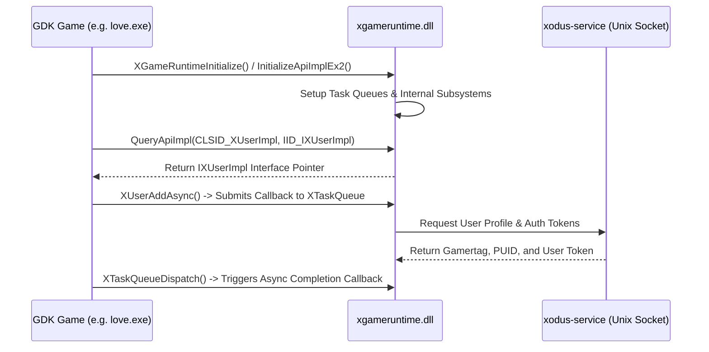

<h1 align="center">xgameruntime-docs</h1>

<strong>Microsoft Gaming Runtime (GDK) Technical Documentation & Reverse Engineering Specifications</strong>

    
    
    

> [!NOTE]
> **Clean-Room Reverse Engineering**: All technical specifications, interfaces, and function signatures in this repository were discovered through black-box reverse engineering adhering to [Wine's clean-room reverse engineering guidelines](https://gitlab.winehq.org/wine/wine/-/wikis/Clean-Room-Guidelines). This documentation is not affiliated with or endorsed by Microsoft Corporation.

---

## 📖 Overview

This repository provides comprehensive technical documentation for the internals of `xgameruntime.dll`, `twinapi.appcore.dll`, and associated [Microsoft Game Development Kit (GDK)](https://aka.ms/gamedevdocs) components.

It serves as the definitive reference manual for:
1. Understanding the Windows Gaming Runtime lifecycle and initialization sequence.
2. Developing open-source compatibility shims such as [`xgameruntime`](https://github.com/nocts-software/xgameruntime).
3. Implementing inter-process communication (IPC) protocols for client daemons like [`xodus`](https://github.com/nocts-software/xodus).

---

## 🏛️ GDK Runtime Architecture & Lifecycle

When a GDK game launches, it interacts with `xgameruntime.dll` via static import libraries (`xgameruntime.lib`) that forward high-level C functions to internal Component Object Model (COM) singletons.

---

## 📑 Core API Entrypoints

`xgameruntime.dll` exports a minimal set of private entrypoints that GDK static libraries dynamically bind to:

| Entrypoint | Description |
|---|---|
| [`InitializeApiImpl`](InitializeApiImpl.md) | Legacy GDK initialization entrypoint |
| [`InitializeApiImplEx`](InitializeApiImplEx.md) | Extended initialization with version checking |
| [`InitializeApiImplEx2`](InitializeApiImplEx2.md) | Modern GDK initialization with runtime flags and `XGameRuntimeOptions` |
| [`QueryApiImpl`](QueryApiImpl.md) | Core factory querying COM implementation classes for GDK interfaces |
| [`UninitializeApiImpl`](UninitializeApiImpl.md) | GDK runtime shutdown and resource cleanup |
| [`XErrorReport`](XErrorReport.md) | Internal telemetry and error reporting |

---

## 🧩 COM Implementation Interfaces

All functional GDK APIs are grouped into 24 distinct COM singleton classes managed by `QueryApiImpl`. Complete interface definitions, method tables, and GUID mappings are documented in the **[COM Classes Reference](COM/README.md)**:

- **Threading & Async**:
  - [`XThreadingImpl`](COM/XThreadingImpl/README.md): Task queue management (`XTaskQueue`), worker ports, and callback dispatching.
- **Identity & Accounts**:
  - [`XUserImpl`](COM/XUserImpl/README.md): User sign-in, gamer pictures, gamertag resolution, and token retrieval.
  - [`XUserDeviceImpl`](COM/XUserDeviceImpl/README.md): Controller and device association with user accounts.
- **Storage & State**:
  - [`XPersistentLocalStorageImpl`](COM/XPersistentLocalStorageImpl/README.md): Persistent local state storage paths for title configurations and local saves.
  - [`XGameSaveImpl`](COM/XGameSaveImpl/README.md): Connected Storage provider and container blobs.
- **Licensing & Catalog**:
  - [`XStoreImpl`](COM/XStoreImpl/README.md): Microsoft Store purchases, license tokens, and add-on entitlements.
  - [`XPackageImpl`](COM/XPackageImpl/README.md): Application package inspection, mount points, and updates.
- **Networking & Social**:
  - [`XNetworkingImpl`](COM/XNetworkingImpl/README.md): Network connectivity, title endpoints, and QoS.
  - [`XGameInviteImpl`](COM/XGameInviteImpl/README.md): Multiplayer game invites and lobby joining.
  - [`XGameUiImpl`](COM/XGameUiImpl/README.md): System UI overlays (player profiles, messages, virtual keyboard).
- **Media & System**:
  - [`XAccessibilityImpl`](COM/XAccessibilityImpl/README.md): Speech synthesis and high-contrast accessibility.
  - [`XAppCaptureImpl`](COM/XAppCaptureImpl/README.md): Screenshots and game clip capture.
  - [`XDisplayImpl`](COM/XDisplayImpl/README.md): Display mode and HDR configuration.
  - [`XSystemImpl`](COM/XSystemImpl/README.md) & [`XSystemAnalyticsImpl`](COM/XSystemAnalyticsImpl/README.md): System memory, device form factor, and analytics.

---

## 🤝 Sister Projects & Upstream
 
 - **[Xodus](https://github.com/nocts-software/xodus)** ([upstream](https://github.com/xodus-gaming/xodus)): Native Linux client and package downloader for Xbox Game Pass and Microsoft Store games.
 - **[xgameruntime](https://github.com/nocts-software/xgameruntime)** ([upstream](https://github.com/xodus-gaming/xgameruntime)): Open-source Wine/Proton implementation of `xgameruntime.dll` implementing these specifications.
 - **Original Upstream Repositories**:
   - [xodus-gaming/xgameruntime-docs](https://github.com/xodus-gaming/xgameruntime-docs)
   - [xodus-gaming/xgameruntime](https://github.com/xodus-gaming/xgameruntime)
   - [xodus-gaming/xodus](https://github.com/xodus-gaming/xodus)

---

## 📜 License & TL;DR

This documentation is licensed under the **GNU General Public License v3.0 (GPL-3.0)**. See [LICENSE](LICENSE) for details.

### 📋 License Summary (TL;DR)

| ✅ What you CAN do | ❌ What you CANNOT do | ⚠️ What you MUST do |
|---|---|---|
| • **Share & Reproduce**: Copy and redistribute documents | • **Exclusive Copyright**: Claim exclusive ownership | • **Disclose Derivative Docs**: Share modifications under GPL-3.0 |
| • **Adapt & Extend**: Translate, expand, and modify | • **Hold Liable**: Documentation provided without warranty | • **Attribute Authors**: Credit original authors & researchers |
| • **Commercial Reference**: Reference in commercial projects | • **Restrict Access**: Place under proprietary paywalls | • **Include Notice**: Retain license and copyright notices |

---

### Acknowledgments
Special thanks to [xodus-gaming](https://github.com/xodus-gaming) for initial documentation, interface discoveries, and reverse engineering research.
